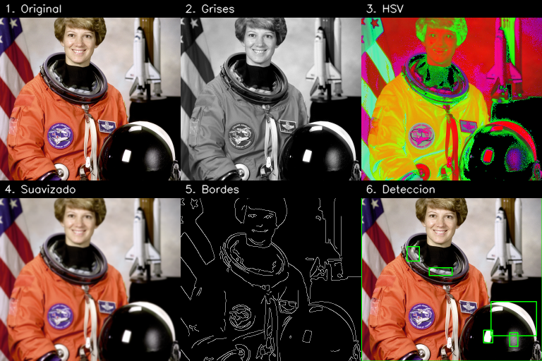

# Ejercicio 1 — Procesamiento visual e IA

Pipeline de procesamiento de imágenes con **OpenCV** que ejecuta, de forma
secuencial, todas las operaciones obligatorias del enunciado y guarda cada
salida para poder compararlas.

## ¿Qué problema o propósito aborda?

Demostrar un flujo clásico de visión por computador sobre una imagen: desde la
carga hasta la **segmentación/detección** de objetos, pasando por conversiones
de color, suavizado y detección de bordes. El objetivo es que cada etapa quede
documentada y sea reproducible con un solo comando.

## Herramientas / librerías

- **Python 3**
- **OpenCV** (`opencv-python`) — operaciones de imagen.
- **NumPy** — manejo de arreglos.
- **scikit-image** — solo para obtener una imagen de muestra (`astronaut`).

## ¿Cómo se ejecuta?

```bash
cd ejercicio_1_procesamiento_visual
pip install -r requirements.txt
python src/main.py                 # usa la imagen de muestra de skimage
# o con tu propia imagen:
python src/main.py data/mi_imagen.jpg
```

Los resultados se escriben en `resultados/`.

## Operaciones y parámetros (decisiones técnicas)

| # | Etapa | Función OpenCV | Parámetros | Justificación |
|---|-------|----------------|------------|---------------|
| 1 | Cargar entrada | `cv2.imread` / `skimage.data.astronaut` | — | Si no se pasa imagen, se usa una de muestra; respaldo: imagen sintética generada por código. |
| 2 | Escala de grises | `cv2.cvtColor(BGR2GRAY)` | — | Base para bordes y segmentación; reduce a 1 canal. |
| 3 | Espacio de color | `cv2.cvtColor(BGR2HSV)` | — | HSV separa color (H,S) de iluminación (V), útil para análisis de color. |
| 4 | Suavizado | `cv2.GaussianBlur` | kernel `7x7`, sigma `0` | Reduce ruido antes de detectar bordes; kernel mediano para no borrar estructuras grandes. `sigma=0` deja que OpenCV lo derive del kernel. |
| 5 | Bordes | `cv2.Canny` | umbral bajo `100`, alto `200` | Relación ~1:2 recomendada por Canny; se aplica sobre la versión suavizada para menos bordes espurios. |
| 6 | Segmentación / detección | Otsu + morfología + contornos | kernel morfológico `5x5`, área mínima `500 px` | Otsu fija el umbral automáticamente; la apertura morfológica elimina ruido; se descartan contornos pequeños y se dibujan *bounding boxes*. |
| 7 | Comparativo | mosaico 2×3 | — | Une todas las etapas en una sola imagen para comparación rápida. |

Todos los parámetros están definidos como constantes al inicio de `src/main.py`
para que sean fáciles de ajustar.

## ¿Qué resultados se obtuvieron?

En `resultados/` se generan:

- `original.png` — entrada.
- `grises.png` — escala de grises.
- `hsv_o_lab.png` — representación HSV.
- `suavizado.png` — suavizado gaussiano.
- `bordes.png` — bordes (Canny).
- `deteccion_o_segmentacion.png` — objetos detectados con cajas verdes.
- `comparativo.png` — mosaico con las 6 etapas.

Con la imagen de muestra (`astronaut`) se detectan 6 regiones.



## Dificultades y cómo se resolvieron

- **skimage entrega RGB y OpenCV usa BGR:** se convierte con `COLOR_RGB2BGR` al
  cargar para que los colores no salgan invertidos.
- **Ruido en la segmentación:** Otsu por sí solo deja puntos sueltos; se añadió
  apertura morfológica y un filtro de área mínima para quedarnos con objetos reales.
- **Mosaico con imágenes de 1 y 3 canales:** las imágenes en gris/bordes se
  convierten a 3 canales antes de apilarlas para que el `hstack`/`vstack` funcione.
