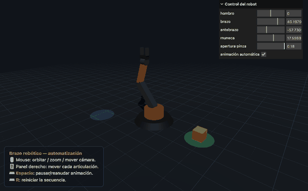

# Ejercicio 2 — Escena 3D interactiva (Three.js)

**Tema:** Robótica / automatización.

Un **brazo robótico articulado** que, de forma autónoma, recoge una pieza de la
zona de origen (verde), la traslada y la deposita en la zona destino (azul). El
usuario puede controlar manualmente cada articulación y la cámara.



## ¿Qué problema o propósito aborda?

Simular una **celda de automatización industrial** sencilla: un manipulador
robótico realizando una tarea de *pick and place*. Sirve para demostrar
jerarquía de objetos, transformaciones encadenadas, materiales PBR, iluminación,
animación e interacción.

## Herramientas / motor

- **Three.js** (`three` ^0.160) — motor de gráficos 3D en WebGL.
- **Vite** — servidor de desarrollo y empaquetado.
- **lil-gui** — panel de sliders para la interacción del usuario.

## ¿Cómo se ejecuta?

```bash
cd ejercicio_2_escena_3d_interactiva
npm install
npm run dev      # abre http://localhost:5173
# producción:
npm run build && npm run preview
```

## Controles

- **Mouse:** orbitar, zoom y desplazar la cámara (OrbitControls).
- **Panel derecho (sliders):** mover hombro, brazo, antebrazo, muñeca y apertura
  de la pinza; casilla para activar/desactivar la animación automática.
- **Barra espaciadora:** pausar / reanudar la animación automática.
- **Tecla R:** reiniciar la secuencia y devolver la pieza al origen.

## Requerimientos del enunciado y dónde se cumplen

| Requerimiento | Cómo se cumple | Archivo |
|---------------|----------------|---------|
| Escena 3D completa basada en un tema | Celda de automatización con brazo robótico | `src/main.js` |
| Jerarquía de objetos 3D | `base → hombro → brazo → antebrazo → muñeca → pinza` con `THREE.Group` anidados | `src/robot.js` |
| Traslación, rotación y escala | Posiciones de cada grupo (traslación), rotaciones de articulaciones, geometrías escaladas | `src/robot.js`, `src/main.js` |
| Cámara interactiva | `PerspectiveCamera` + `OrbitControls` | `src/main.js` |
| Materiales PBR o shader | `MeshStandardMaterial` con `metalness`/`roughness` | `src/robot.js`, `src/main.js` |
| Iluminación coherente | `AmbientLight` + `DirectionalLight` (con sombras) + `PointLight` de acento | `src/main.js` |
| Animación de elementos | Secuencia de poses interpolada en el bucle de render | `src/main.js` (`POSES`, `actualizarAnimacion`) |
| Interacción entre elementos | La pinza **agarra** la pieza (se reparenta a la muñeca) y la **suelta** en el destino | `src/main.js` (`agarrarPieza`, `soltarPieza`) |
| Interacción del usuario | Sliders (lil-gui) + teclado (espacio, R) + cámara con mouse | `src/main.js` |

## ¿Qué resultados se obtuvieron?

La escena se ejecuta de forma fluida. El brazo realiza el ciclo completo de
*pick and place* en bucle, con sombras y luz de acento pulsante. El usuario puede
intervenir las articulaciones en cualquier momento. Evidencias en `media/`:

- `captura_1.png` — el brazo desciende hacia la pieza.
- `captura_2.png` — el brazo sujeta y eleva la pieza.
- `demo.gif` — ciclo completo de la animación.

## Estructura

```text
ejercicio_2_escena_3d_interactiva/
├── index.html        # contenedor + overlay de ayuda
├── package.json
├── src/main.js       # escena, cámara, luces, animación, interacción
├── src/robot.js      # construcción jerárquica del brazo (materiales PBR)
└── media/            # capturas y demo.gif
```

## Dificultades y cómo se resolvieron

- **Pivotes de las articulaciones:** para que cada segmento rote desde su
  articulación (y no desde su centro), la malla se desplaza dentro de su grupo y
  se rota el grupo, no la malla. Así el "codo" se comporta de forma natural.
- **"Agarrar" la pieza:** en vez de seguir la posición de la pinza manualmente,
  se **reparenta** la pieza al nodo `puntoAgarre` (hijo de la pinza); al soltarla
  se devuelve a la escena. Esto mantiene la coherencia de la jerarquía.
- **Sincronizar sliders y animación:** los valores de las articulaciones viven en
  un único objeto `estado`; la animación los modifica y los sliders usan `.listen()`
  para reflejar el cambio en tiempo real.
