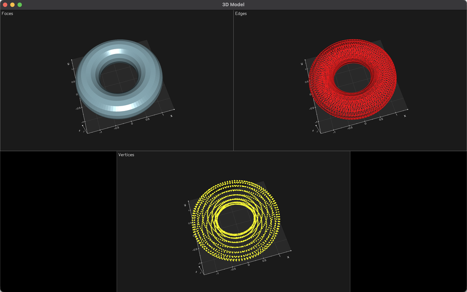
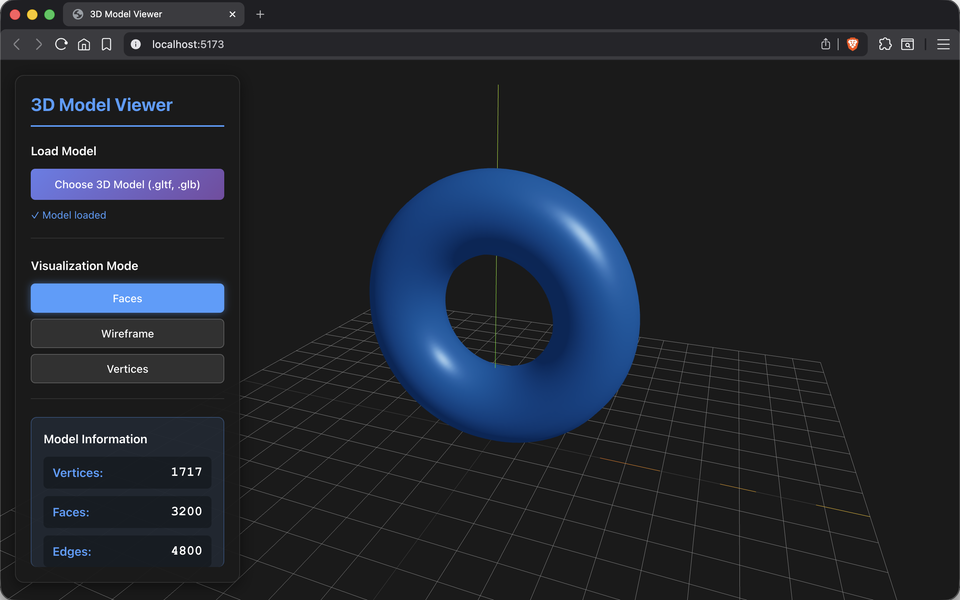

# Construyendo el Mundo 3D: Vértices, Aristas y Caras

## Nombre del estudiante

Cristian Steven Motta Ojeda

## Fecha de entrega

`2026-02-21`

---

## Descripción breve

En este taller se construyeron dos visores de modelos 3D, uno en Python y otro en la web con Three.js/React Three Fiber. El objetivo fue cargar modelos en formatos comunes (.obj, .stl, .gltf/.glb), inspeccionar su estructura y visualizar distintas representaciones geométricas (caras, aristas y vertices).

En Python se implemento un flujo con trimesh y vedo para cargar el modelo, extraer estadisticas basicas (vertices, caras y aristas) y mostrar vistas separadas por tipo de representacion. En Three.js se creo un visor interactivo que permite subir un archivo, alternar entre modos de visualizacion y navegar la escena con controles orbit.

---

## Implementaciones

### Python

Notebook con trimesh y vedo para cargar modelos 3D (.obj, .stl, .gltf/.glb), calcular estadisticas (vertices, caras y aristas) y visualizar tres representaciones: caras con material solido, aristas en wireframe y vertices como puntos. Incluye una funcion para combinar escenas GLTF en una sola malla.

### Three.js / React Three Fiber

Visor 3D interactivo en React Three Fiber con carga de archivos .gltf/.glb desde el navegador, controles Orbit, grilla y ejes de referencia. Se implementaron tres modos de visualizacion (caras, wireframe, vertices) y un panel de control con estadisticas del modelo (vertices, caras, aristas). El modelo se escala y centra automaticamente con base en su bounding box.

---

## Resultados visuales

### Python - Implementación



Vista de caras, aristas y vertices.


Vista interactiva de caras, aristas y vertices.

### Three.js - Implementación



Vista de caras.


Vista interactiva de aristas.

---

## Código relevante

### Ejemplo de código Python:

```python
import trimesh

def load_model(file_path):
  model = trimesh.load(file_path)
  if isinstance(model, trimesh.Scene):
    model = trimesh.util.concatenate(
      tuple(trimesh.Trimesh(vertices=g.vertices, faces=g.faces)
          for g in model.geometry.values())
    )
  return model
```

### Ejemplo de código Three.js:

```javascript
import { useGLTF } from '@react-three/drei'

function Model({ url }) {
  const { scene } = useGLTF(url)
  return <primitive object={scene} />
}
```

---

## Prompts utilizados

No se utilizaron prompts de IA en este taller.

---

## Aprendizajes y dificultades

Se reforzo el flujo de carga y normalizacion de modelos 3D en distintos entornos, especialmente el manejo de escenas GLTF y el calculo de estadisticas estructurales. Tambien se practico la representacion visual de una malla con distintas tecnicas (caras, aristas, vertices) y la integracion de controles de camara en un visor web.

En el desarrollo web, el principal reto fue clonar la escena y ajustar la escala/centrado para que todos los modelos se visualizaran correctamente. Se resolvio aplicando bounding boxes y normalizando el tamaño antes de renderizar.

### Aprendizajes

Manejo de modelos 3D con trimesh/vedo, extraccion de estadisticas de mallas y buenas practicas para visualizacion interactiva con React Three Fiber.

### Dificultades

Normalizacion de escala y centrado del modelo en Three.js; se soluciono calculando el bounding box, reescalando y moviendo el modelo al origen.

### Mejoras futuras

Agregar soporte para mas formatos, visualizacion de normales y exportacion de capturas desde ambos visores.

---

## Contribuciones grupales (si aplica)

Taller realizado de forma individual.

---

## Estructura del proyecto

```
semana_01_1_construyendo_mundo_3d/
├── python/
│   ├── notebook.ipynb    # Visualización de vértices, aristas y caras
│   └── torus.glb         # Modelo de prueba
├── threejs/
│   ├── src/
│   │   ├── App.jsx              # Componente principal con estado
│   │   ├── components/
│   │   │   ├── ModelViewer.jsx  # Visor con modos de visualización
│   │   │   └── Controls.jsx     # Panel de control y estadísticas
│   ├── public/models/
│   └── package.json
├── media/                # Imágenes y GIFs de resultados
└── README.md            # Este archivo
```

---

## Referencias

Lista las fuentes, tutoriales, documentación o papers consultados durante el desarrollo:

- Trimesh: https://trimesh.org/
- Vedo: https://vedo.embl.es/
- React Three Fiber: https://docs.pmnd.rs/react-three-fiber/
- Drei (helpers): https://github.com/pmndrs/drei
- Three.js: https://threejs.org/docs/

---
