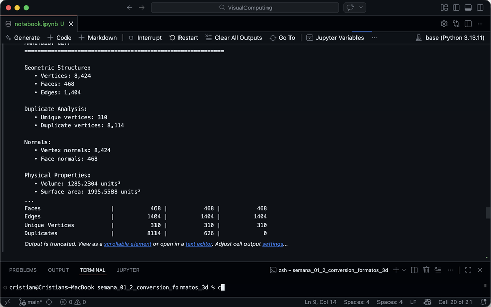
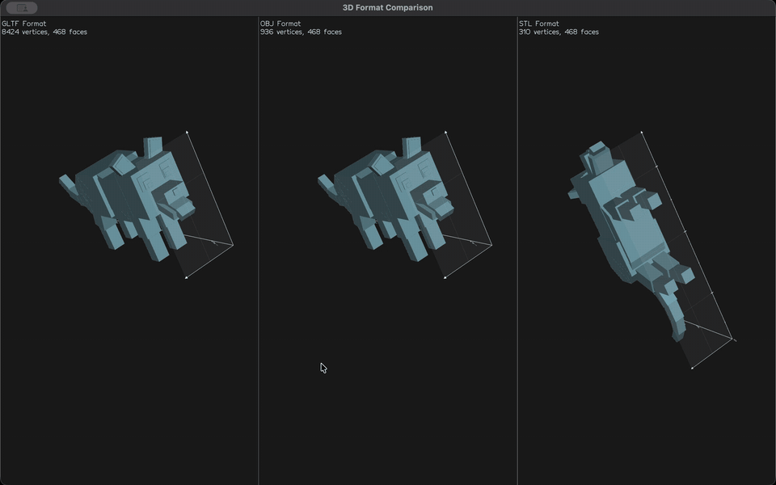
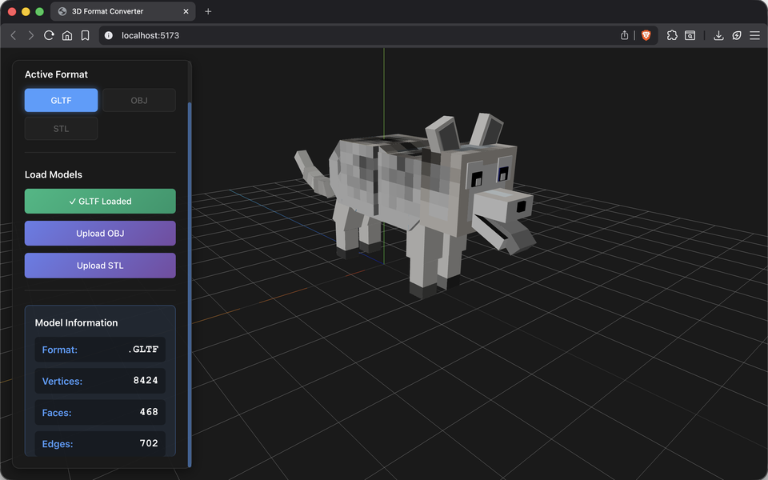

# Importando el Mundo: Visualización y Conversión de Formatos 3D

## Nombre del estudiante

Cristian Steven Motta Ojeda

## Fecha de entrega

`2026-02-21`

---

## Descripción breve

Este taller se centra en la comparación y conversión entre distintos formatos de modelos 3D: .OBJ, .STL y .GLTF. El objetivo es entender la estructura interna de cada formato, su compatibilidad entre entornos, y cómo se interpretan en plataformas de visualización.

En Python se desarrolló un notebook con trimesh para cargar modelos en los tres formatos, analizar sus propiedades estructurales (vértices, caras, aristas, duplicados, normales), realizar conversiones entre formatos y comparar los resultados. En Three.js se construyó un visor interactivo que permite cargar los tres formatos simultáneamente y alternar entre ellos con botones, observando las diferencias en renderizado y geometría.

---

## Implementaciones

### Python

El notebook implementa funciones para cargar modelos en formatos .OBJ, .STL y .GLTF/.GLB usando trimesh, con soporte para escenas GLTF complejas. Incluye análisis detallado de geometría (vértices, caras, aristas, duplicados, normales, volumen, bounding box, validación watertight), comparación estructural entre formatos mediante tablas, conversión entre formatos con trimesh.export (individual y por lotes), y visualización comparativa lado a lado con vedo.

### Three.js / React Three Fiber

Visor 3D interactivo en React con upload independiente para cada formato (GLTF, OBJ, STL) y selector para alternar entre los tres modelos cargados. Muestra información en tiempo real del formato activo con métricas de vértices, caras y aristas. Todos los modelos se normalizan automáticamente mediante cálculo de bounding box, escalado y centrado. Incluye OrbitControls para navegación completa y emplea loaders específicos por formato: useGLTF, OBJLoader y STLLoader (este último requiere creación manual de malla con material).

---

## Resultados visuales

### Python - Implementación



Análisis comparativo de formatos mostrando estadísticas detalladas de vértices, caras, aristas y duplicados para GLTF, OBJ y STL.



Visualización interactiva comparando los tres formatos lado a lado con vedo.

### Three.js - Implementación



Interfaz del visor con panel de control para selección de formatos y carga de modelos.


Alternado dinámico entre formatos GLTF, OBJ y STL mostrando información del modelo activo.

---

## Código relevante

### Ejemplo de código Python - Carga y análisis:

```python
def load_model(file_path):
    model = trimesh.load(file_path, force='mesh')
    
    if isinstance(model, trimesh.Scene):
        model = trimesh.util.concatenate(
            tuple(trimesh.Trimesh(vertices=g.vertices, faces=g.faces)
                  for g in model.geometry.values())
        )
    
    return model

def analyze_model(model, format_name):
    unique_vertices = len(np.unique(model.vertices, axis=0))
    duplicate_vertices = len(model.vertices) - unique_vertices
    
    return {
        'vertices': len(model.vertices),
        'faces': len(model.faces),
        'unique_vertices': unique_vertices,
        'duplicates': duplicate_vertices,
        'volume': model.volume,
        'is_watertight': model.is_watertight
    }
```

### Ejemplo de código Python - Conversión:

```python
def convert_format(model, output_path, target_format):
    output_file = f"{output_path}.{target_format}"
    
    if target_format.lower() in ['gltf', 'glb']:
        scene = trimesh.Scene(model)
        scene.export(output_file)
    else:
        model.export(output_file)
    
    return output_file
```

### Ejemplo de código Three.js - Carga multi-formato:

```javascript
function Model({ url, format, viewMode, onModelLoad }) {
  let scene = null
  
  if (format === 'gltf') {
    const gltf = useGLTF(url)
    scene = gltf.scene
  } else if (format === 'obj') {
    const obj = useLoader(OBJLoader, url)
    scene = obj
  } else if (format === 'stl') {
    const geometry = useLoader(STLLoader, url)
    const material = new THREE.MeshStandardMaterial({ 
      color: '#808080', 
      metalness: 0.5, 
      roughness: 0.5 
    })
    const mesh = new THREE.Mesh(geometry, material)
    scene = new THREE.Group()
    scene.add(mesh)
  }
  
  // Normalización y procesamiento...
}
```

### Ejemplo de código Three.js - Gestión de estado:

```javascript
const [models, setModels] = useState({
  gltf: '',
  obj: '',
  stl: ''
})

const handleFormatUpload = (format, path) => {
  setModels(prev => ({
    ...prev,
    [format]: path
  }))
  setCurrentFormat(format)
}
```

---

## Prompts utilizados

Se utilizó GitHub Copilot para:
1. Implementar loaders específicos para cada formato en Three.js
2. Diseñar la estructura de análisis comparativo en Python
3. Crear funciones de conversión con trimesh

---

## Aprendizajes y dificultades

### Aprendizajes

El trabajo con múltiples formatos reveló que cada uno tiene propósitos específicos: GLTF para web con materiales completos, OBJ para intercambio universal, STL para fabricación. Se aprendió la importancia del análisis de geometría (vértices duplicados, normales, propiedades físicas) para optimizar modelos, así como las limitaciones de las conversiones que preservan geometría pero pierden materiales. También se entendió que cada formato requiere loaders específicos en Three.js, algunos retornando solo geometría (STL), y la necesidad de implementar normalización automática consistente para todos los formatos.

### Dificultades

La principal dificultad fue manejar las particularidades de STLLoader que solo retorna geometría, resolviéndose con creación manual de malla con material. Mantener tres modelos cargados simultáneamente requirió diseño cuidadoso de estados, y calcular métricas consistentes entre formatos con estructuras diferentes presentó desafíos. La combinación de escenas GLTF para análisis también requirió atención especial al concatenar geometrías.

### Mejoras futuras

Posibles extensiones incluyen visualización de diferencias en normales, preview de texturas, métricas de calidad de malla (aspect ratio), y exportación de reportes comparativos en PDF.

---

## Contribuciones grupales (si aplica)

Taller realizado de forma individual.

---

## Estructura del proyecto

```
semana_01_2_conversion_formatos_3d/
├── python/
│   ├── notebook.ipynb    # Análisis y conversión de formatos
│   ├── husky.gltf        # Modelo de prueba GLTF
│   ├── husky.obj         # Modelo OBJ
│   └── husky.stl         # Modelo STL
├── threejs/
│   ├── src/
│   │   ├── App.jsx              # Gestión de estados de formatos
│   │   ├── components/
│   │   │   ├── ModelViewer.jsx  # Loaders por formato
│   │   │   └── Controls.jsx     # Selector y upload
│   ├── public/models/
│   └── package.json
├── media/                # Imágenes y GIFs de resultados
└── README.md            # Este archivo
```

---

## Referencias

Lista de fuentes, tutoriales y documentación consultados:

- **Trimesh**: https://trimesh.org/ - Librería para manipulación de mallas 3D
- **Vedo**: https://vedo.embl.es/ - Visualización científica 3D
- **React Three Fiber**: https://docs.pmnd.rs/react-three-fiber/ - React renderer para Three.js
- **Three.js Loaders**: https://threejs.org/docs/#examples/en/loaders/OBJLoader - OBJLoader, STLLoader
- **Drei**: https://github.com/pmndrs/drei - Helpers para R3F
- **GLTF Specification**: https://github.com/KhronosGroup/glTF - Especificación del formato
- **Trimesh Export**: https://trimesh.org/trimesh.exchange.html - Conversión entre formatos

---
