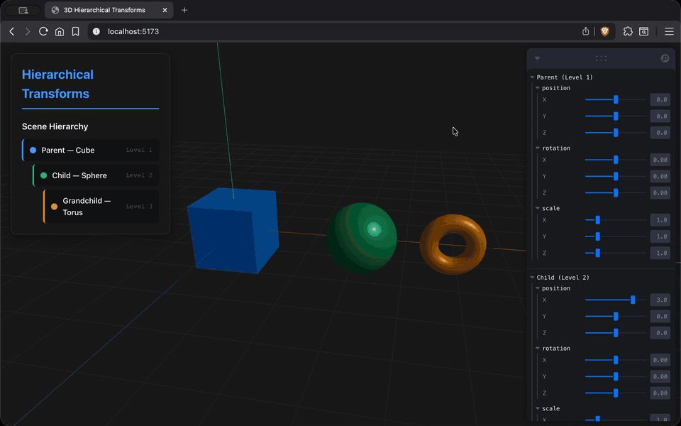
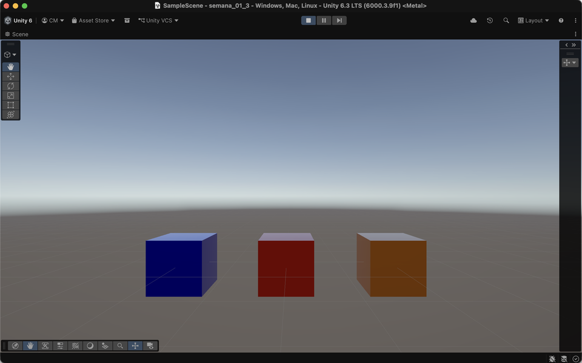
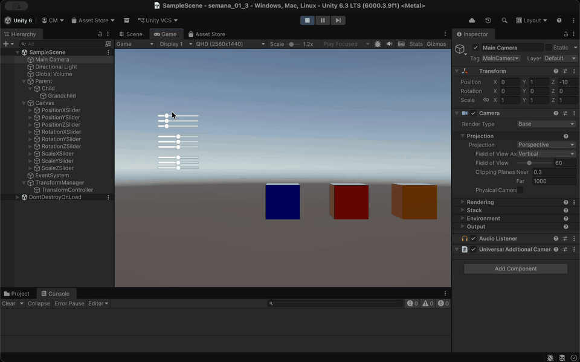

# Taller - Jerarquías y Transformaciones: El Árbol del Movimiento

## Nombre del estudiante

Cristian Steven Motta Ojeda

## Fecha de entrega

`2026-02-22`

---

## Descripción breve

Este taller explora cómo las jerarquías y transformaciones organizan escenas 3D y simulan movimiento. El objetivo es entender cómo los cambios en un objeto padre afectan a sus hijos.

Se crearon dos proyectos, uno con **Three.js/React Three Fiber** y otro con **Unity**. Ambos usan una jerarquía de tres niveles (padre-hijo-nieto) con controles interactivos para ver la propagación de transformaciones en tiempo real.

---

## Implementaciones

### Three.js / React Three Fiber

Se creó una escena con Vite y R3F usando `group` y `mesh` para anidar objetos. Se usó la librería **Leva** para añadir sliders que controlan la rotación y posición del nodo padre, mostrando cómo los hijos heredan el movimiento.

### Unity

En Unity, se anidaron tres `GameObjects` (cápsulas). Un script de C# (`TransformController.cs`) en el padre permite controlar su posición y rotación con `Sliders` de la UI, demostrando la herencia de transformaciones.

---

## Resultados visuales

### Three.js - Implementación


Jerarquía en Three.js con panel de Leva para controlar al objeto padre (rojo).



Demostración de la rotación del padre, que hace orbitar a sus hijos.

### Unity - Implementación



Escena en Unity con la jerarquía de cápsulas y sliders para controlar al padre.



Animación del sistema en Unity, donde los hijos siguen el movimiento del padre.

---

## Código relevante

### Ejemplo de código Three.js - Jerarquía y Controles con Leva:

```javascript
// App.jsx
import { useControls } from 'leva';

function App() {
  const { position, rotation } = useControls({
    position: { value: [0, 0, 0], step: 0.1 },
    rotation: { value: [0, 0, 0], step: 0.01 },
  });

  return (
    <group position={position} rotation={rotation}>
      <mesh> {/* Padre */}
        <boxGeometry />
        <meshStandardMaterial color="red" />
      </mesh>
      <group position={[2, 0, 0]}> {/* Hijo */}
        <mesh>
          <boxGeometry />
          <meshStandardMaterial color="blue" />
        </mesh>
        <group position={[0, 2, 0]}> {/* Nieto */}
          <mesh>
            <boxGeometry />
            <meshStandardMaterial color="green" />
          </mesh>
        </group>
      </group>
    </group>
  );
}
```

### Ejemplo de código Unity - Script de Control en C#:

```csharp
// TransformController.cs
using UnityEngine;
using UnityEngine.UI;

public class TransformController : MonoBehaviour
{
    public Slider positionXSlider;
    public Slider rotationYSlider;

    private Vector3 initialPosition;

    void Start()
    {
        initialPosition = transform.position;
    }

    void Update()
    {
        float posX = initialPosition.x + positionXSlider.value;
        transform.position = new Vector3(posX, transform.position.y, transform.position.z);

        float rotY = rotationYSlider.value;
        transform.rotation = Quaternion.Euler(0, rotY, 0);

        Debug.Log($"Position: {transform.position}, Rotation: {transform.rotation.eulerAngles}");
    }
}
```

---

## Prompts utilizados

Se utilizó GitHub Copilot para:
1.  Generar la estructura base de la escena en React Three Fiber.
2.  Implementar el script de C# en Unity para controlar las transformaciones.
3.  Configurar los sliders de la UI en Unity y vincularlos al script.

---

## Aprendizajes y dificultades

### Aprendizajes

Este taller ayudó a entender el **árbol de escena** y cómo las transformaciones se componen en una jerarquía. En R3F, `Leva` simplifica la creación de controles interactivos. En Unity, el editor facilita la vinculación de objetos y scripts.

### Dificultades

En Unity, la configuración del Canvas y los Sliders de la UI requirió tiempo.

### Mejoras futuras

En **Three.js**, se podría añadir una animación automática con controles de pausa.

En **Unity**, se podría implementar el bonus de animación y permitir al usuario seleccionar qué objeto de la jerarquía controlar.

---

## Contribuciones grupales (si aplica)

Taller realizado de forma individual.

---

## Estructura del proyecto

```
semana_01_3_jerarquias_transformaciones/
├── threejs/
│   ├── src/
│   │   ├── App.jsx              # Componente principal con la jerarquía y Leva
│   │   └── ...
│   └── ...
├── unity/
│   ├── Assets/
│   │   ├── Scenes/
│   │   │   └── SampleScene.unity  # Escena principal con los objetos y la UI
│   │   ├── TransformController.cs # Script de control para el padre
│   │   └── ...
│   └── ...
├── media/                       # Imágenes y GIFs de resultados
└── README.md                    # Este archivo
```

---

## Referencias

Lista de fuentes, tutoriales y documentación consultados:

- **React Three Fiber Documentation**: https://docs.pmnd.rs/react-three-fiber/
- **Leva Documentation**: https://github.com/pmndrs/leva - Librería para paneles de control en React.
- **Unity Manual: Transforms**: https://docs.unity3d.com/Manual/class-Transform.html
- **Three.js Fundamentals: Scene Graph**: https://threejs.org/manual/#en/scenegraph
- **Catlike Coding: Unity Tutorials**: https://catlikecoding.com/unity/tutorials/ - Referencia para conceptos avanzados de Unity.

---
