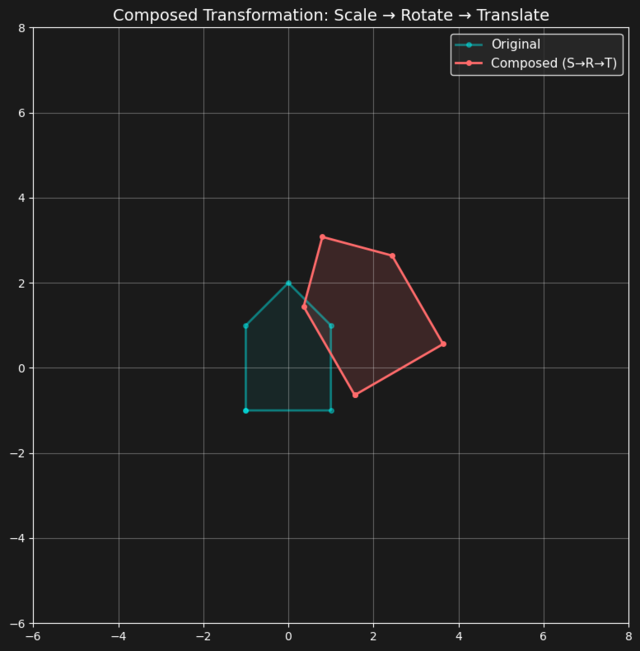
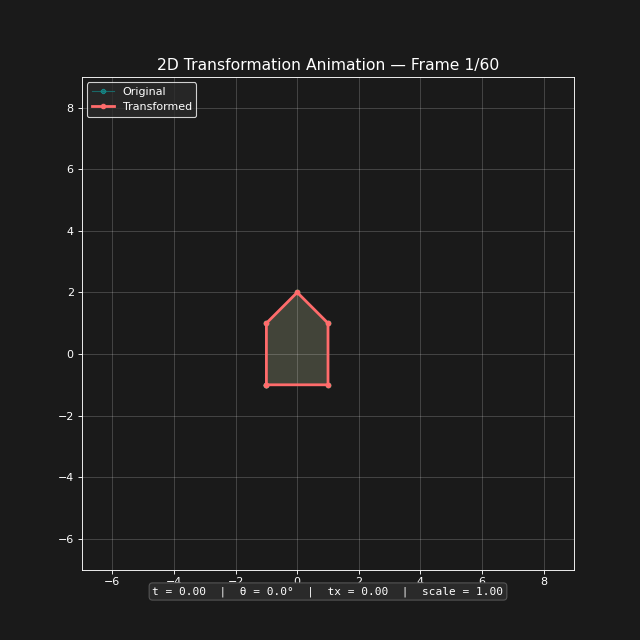
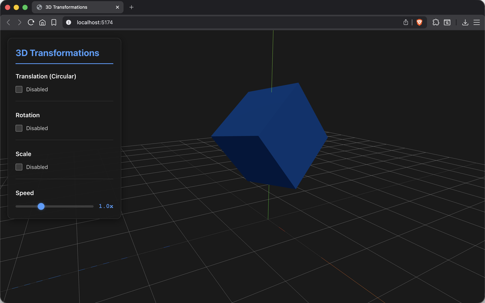
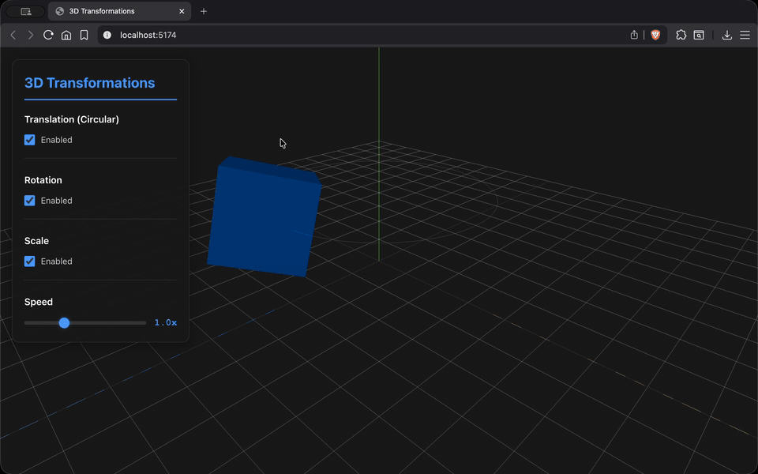
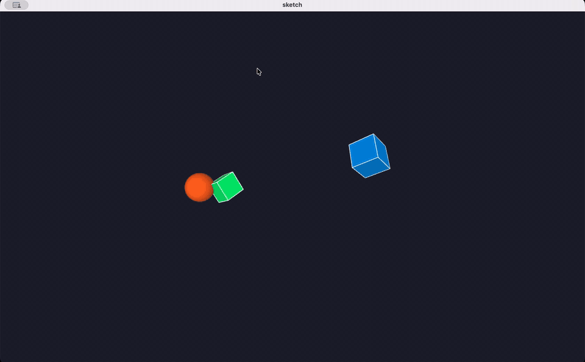

# Transformaciones Geométricas 2D y 3D

## Nombre del estudiante

Cristian Steven Motta Ojeda

## Fecha de entrega

`2026-02-23`

---

## Descripción breve

Este taller explora las transformaciones geométricas fundamentales: traslación, rotación y escalado. Se implementan en tres entornos distintos: Python (2D con matrices homogéneas), Three.js (3D interactivo) y Processing (3D animado), permitiendo comparar cómo se aplican estas operaciones en diferentes contextos.

---

## Implementaciones

### Python

Notebook que define una figura 2D (casa) en coordenadas homogéneas y aplica transformaciones mediante matrices 3×3: traslación, rotación y escalado, tanto individuales como compuestas (T·R·S). Incluye interpolación con ease-in-out y generación de una animación GIF que muestra la transformación progresiva con trail de posiciones anteriores.

### Three.js / React Three Fiber

Visor 3D interactivo con un cubo animado que combina traslación circular, rotación continua y escalado cíclico. Panel de controles para activar/desactivar cada transformación independientemente y ajustar la velocidad. Incluye visualización de la trayectoria circular, grid y ejes de referencia.

### Processing

Escena 3D con tres objetos animados: un cubo principal con traslación ondulante (sin/cos), rotación en los tres ejes y escalado cíclico; una esfera orbitante con escalado pulsante; y un segundo cubo en órbita opuesta con rotaciones compuestas. Usa `pushMatrix()`/`popMatrix()` para aislar las transformaciones de cada objeto.

---

## Resultados visuales

### Python - Implementación



Transformaciones individuales (traslación, rotación, escalado) aplicadas a la figura 2D original.



Animación de transformación compuesta con interpolación suave y trail de posiciones.

### Three.js - Implementación



Visor 3D con panel de controles para activar/desactivar transformaciones.



Cubo animado con traslación circular, rotación y escalado cíclico en tiempo real.

### Processing - Implementación



Escena 3D con múltiples objetos aplicando transformaciones jerárquicas simultáneas.

---

## Código relevante

### Ejemplo de código Python - Matrices de transformación:

```python
def translation_matrix(tx, ty):
    return np.array([
        [1, 0, tx],
        [0, 1, ty],
        [0, 0,  1]
    ], dtype=float)

def rotation_matrix(angle_deg):
    theta = np.radians(angle_deg)
    c, s = np.cos(theta), np.sin(theta)
    return np.array([
        [c, -s, 0],
        [s,  c, 0],
        [0,  0, 1]
    ], dtype=float)

def scale_matrix(sx, sy):
    return np.array([
        [sx,  0, 0],
        [ 0, sy, 0],
        [ 0,  0, 1]
    ], dtype=float)

# Composición: Scale → Rotate → Translate
M_combined = T @ R @ S
house_composed = M_combined @ house
```

### Ejemplo de código Three.js - Cubo animado:

```javascript
useFrame(({ clock }) => {
  const t = clock.getElapsedTime() * speed

  // Traslación: trayectoria circular
  if (enableTranslation) {
    meshRef.current.position.x = Math.cos(t) * radius
    meshRef.current.position.z = Math.sin(t) * radius
  }

  // Rotación: incremento por frame
  if (enableRotation) {
    meshRef.current.rotation.x += 0.01 * speed
    meshRef.current.rotation.y += 0.02 * speed
  }

  // Escalado: función temporal suave
  if (enableScale) {
    const scaleValue = 1 + Math.sin(t) * 0.4
    meshRef.current.scale.set(scaleValue, scaleValue, scaleValue)
  }
})
```

### Ejemplo de código Processing - Transformaciones jerárquicas:

```java
pushMatrix();
  translate(width / 2, height / 2, 0);
  
  // Traslación ondulante
  translate(sin(t * 1.2) * 150, cos(t * 0.8) * 60, sin(t * 0.5) * 80);
  
  // Rotación continua en 3 ejes
  rotateX(t * 0.7);
  rotateY(t * 1.0);
  rotateZ(t * 0.4);
  
  // Escalado cíclico
  scale(1.0 + 0.35 * sin(t * 2.0));
  
  box(80);
popMatrix();
```

---

## Prompts utilizados

Se utilizó GitHub Copilot para:
1. Estructurar las funciones de interpolación y generación de frames en Python
2. Implementar el componente AnimatedCube con useFrame en Three.js
3. Diseñar el panel de controles con toggles y slider de velocidad

---

## Aprendizajes y dificultades

### Aprendizajes

Se comprendió la importancia de las coordenadas homogéneas para unificar traslación, rotación y escalado en una sola multiplicación matricial. La composición de transformaciones (T·R·S) demostró que el orden importa significativamente en el resultado. En Processing, `pushMatrix()`/`popMatrix()` permite aislar transformaciones por objeto, similar al concepto de jerarquía de escena en Three.js.

### Dificultades

En Python, generar la animación GIF frame a frame requirió cuidado con el manejo de memoria y la conversión del canvas de matplotlib a array de imagen. En Three.js, la rotación incremental por frame (en lugar de basada en tiempo absoluto) produce resultados distintos según el framerate, lo cual fue una decisión de diseño consciente.

### Mejoras futuras

Agregar visualización de las matrices en tiempo real, y permitir al usuario definir parámetros de transformación interactivamente en Python.

---

## Contribuciones grupales (si aplica)

Taller realizado de forma individual.

---

## Estructura del proyecto

```
semana_01_4_transformaciones/
├── python/
│   └── notebook.ipynb         # Transformaciones 2D con matrices
├── threejs/
│   ├── src/
│   │   ├── App.jsx            # Estado de transformaciones
│   │   └── components/
│   │       ├── ModelViewer.jsx # Cubo animado con useFrame
│   │       └── Controls.jsx   # Panel de controles
│   └── package.json
├── processing/
│   └── sketch.pde             # Escena 3D con transformaciones
├── media/                     # Imágenes y GIFs de resultados
└── README.md                  # Este archivo
```

---

## Referencias

- **NumPy**: https://numpy.org/ - Operaciones matriciales
- **Matplotlib**: https://matplotlib.org/ - Visualización y generación de frames
- **imageio**: https://imageio.readthedocs.io/ - Exportación de GIF animado
- **React Three Fiber**: https://docs.pmnd.rs/react-three-fiber/ - React renderer para Three.js
- **Drei**: https://github.com/pmndrs/drei - Helpers para R3F (OrbitControls)
- **Processing**: https://processing.org/reference/ - Referencia de transformaciones 3D

---
