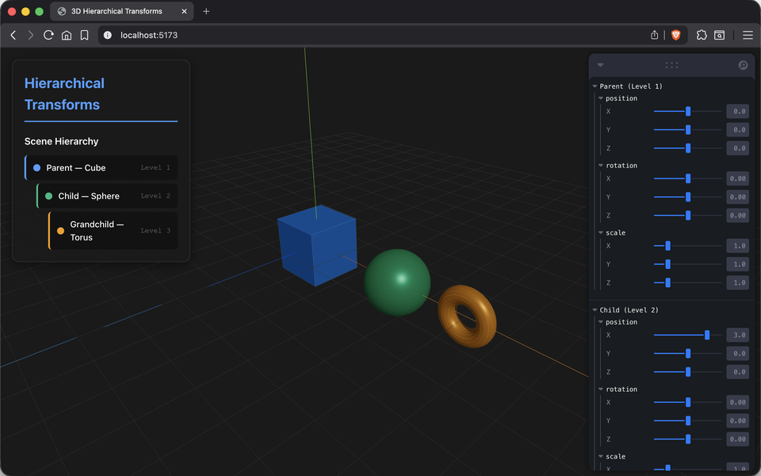
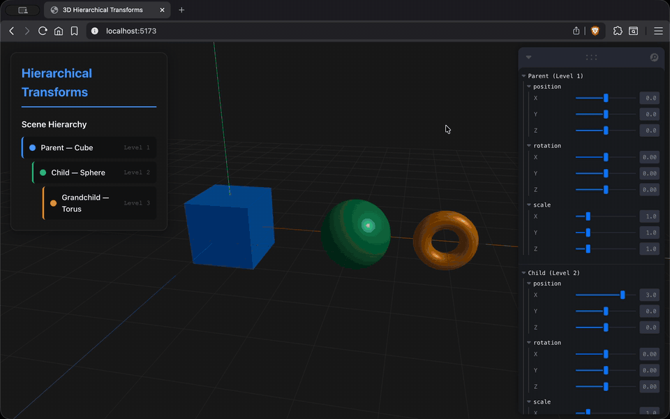

# Actividad S2_1 - Descomponiendo el Pipeline Gráfico

## Nombre de los estudiantes

- Sebastián Andrade Cedano
- Esteban Barrera Sanabria
- Cristian Steven Motta Ojeda
- Juan Esteban Santacruz Corredor

## Fecha de entrega

`2026-02-18`

---

## Descripción breve

En esta actividad se trabajó el tema de **Jerarquías y Grafos de Escena**, explorando cómo se organizan estructuras complejas dentro de un motor de renderizado 3D.

El objetivo principal fue comprender el funcionamiento del **scene graph** como estructura de datos para representar relaciones padre-hijo entre objetos, la **propagación de matrices de transformación** a través de la jerarquía, el recorrido del grafo mediante **DFS (Depth-First Search)** y el uso del **matrix stack** para gestionar las transformaciones acumuladas.

Se construyó una aplicación interactiva en Three.js (React Three Fiber) que permite manipular en tiempo real las transformaciones (posición, rotación y escala) de tres niveles jerárquicos — Parent, Child y Grandchild — y observar cómo los cambios en un nodo padre se propagan automáticamente a sus descendientes.

---

## Temas abordados

**Tema 4: Jerarquías y Grafos de Escena**

- **Scene graph:** estructura de datos en forma de grafo dirigido acíclico (DAG) o árbol que organiza los objetos de una escena 3D, definiendo relaciones espaciales y lógicas entre ellos.
- **Relación padre-hijo:** cada nodo del grafo puede contener nodos hijos; las transformaciones del padre se aplican como contexto base para todos sus descendientes, permitiendo mover conjuntos de objetos como una unidad.
- **Propagación de matrices:** la matriz de transformación mundial de un nodo se calcula como el producto de su matriz local por la matriz mundial de su padre: $M_{world} = M_{parent} \cdot M_{local}$, propagándose recursivamente desde la raíz.
- **DFS (Depth-First Search):** algoritmo utilizado para recorrer el scene graph, visitando primero cada rama hasta sus hojas antes de retroceder, lo que permite aplicar y deshacer transformaciones de forma ordenada.
- **Matrix stack:** pila de matrices que almacena el estado de transformación acumulado en cada nivel del recorrido. Al descender en la jerarquía se hace push de la matriz actual multiplicada por la local, y al retroceder se hace pop para restaurar el estado previo.
- **Transformaciones locales vs. globales:** distinción entre la posición/rotación/escala definida respecto al padre (local) y la resultante en coordenadas de mundo (global), fundamental para entender el comportamiento jerárquico.

---

## Implementación

### Three.js + React Three Fiber

Se construyó una aplicación web interactiva con **React Three Fiber** y la librería de controles **Leva** que permite visualizar y manipular una jerarquía de 3 niveles:

| Nivel | Objeto | Color | Geometría |
|-------|--------|-------|-----------|
| 1 (Parent) | Cubo | Azul (`#4a9eff`) | `BoxGeometry` |
| 2 (Child) | Esfera | Verde (`#10b981`) | `SphereGeometry` |
| 3 (Grandchild) | Toro | Naranja (`#f59e0b`) | `TorusGeometry` |

**Características implementadas:**

- **Panel de jerarquía visual:** muestra la estructura padre-hijo con colores e indentación por nivel.
- **Controles individuales por nodo:** cada objeto tiene sliders para posición (X, Y, Z), rotación (X, Y, Z) y escala (X, Y, Z) mediante la librería Leva.
- **Propagación automática de transformaciones:** al modificar la posición, rotación o escala del Parent, los cambios se propagan al Child y al Grandchild; al modificar el Child, solo el Grandchild se ve afectado.
- **Bordes con `EdgesGeometry`:** cada objeto muestra un contorno semitransparente para facilitar la visualización de la geometría.
- **Escena con grilla y ejes:** se incluye un `gridHelper` y un `axesHelper` como referencia espacial.
- **Cámara orbital:** navegación libre con `OrbitControls` (rotación, zoom y paneo).

---

## Resultados visuales

### Captura 1 - Vista general de la jerarquía



Vista de la aplicación mostrando los tres objetos (Cubo, Esfera y Toro) en su posición inicial, con el panel de jerarquía a la izquierda y los controles de Leva a la derecha.

### GIF 1 - Propagación de transformaciones



Demostración interactiva de cómo las transformaciones del nodo padre se propagan a los nodos hijos: al rotar o mover el cubo (Parent), la esfera (Child) y el toro (Grandchild) se transforman conjuntamente, manteniendo sus posiciones relativas.

---

## Prompts utilizados

- "Crea una escena en React Three Fiber con una jerarquía de 3 niveles (Parent: cubo, Child: esfera, Grandchild: toro) donde cada nivel tenga controles independientes de posición, rotación y escala usando la librería Leva."
- "Agrega un componente de visualización de la jerarquía (panel lateral) que muestre los nodos con colores e indentación por nivel, similar a un explorador de escena."
- "Implementa un `EdgesGeometry` overlay sobre cada mesh para que se vean los bordes del wireframe de forma semitransparente sin ocultar el material sólido."
- "Dame un esquema CSS para un panel de controles con fondo oscuro semitransparente, bordes redondeados y una jerarquía de nodos con líneas de conexión visual por nivel."

---

## Aprendizajes y dificultades

### Aprendizajes

Se comprendió de forma práctica cómo funciona un scene graph: al anidar `<group>` dentro de `<group>` en Three.js, las transformaciones se propagan automáticamente siguiendo la misma lógica de multiplicación de matrices ($M_{world} = M_{parent} \cdot M_{local}$) que describe la teoría. También se reforzó la importancia del DFS y el matrix stack como mecanismos internos que el motor utiliza para recorrer y renderizar la escena de forma eficiente.

### Dificultades

La parte más desafiante fue diseñar los controles de Leva de manera que cada nivel pudiera manipularse de forma independiente sin interferir con los demás, y asegurar que la visualización reflejara correctamente la propagación jerárquica. También fue necesario calibrar los rangos de los sliders para que las transformaciones fueran intuitivas y no generaran superposiciones confusas entre los objetos.

### Mejoras futuras

Como mejora, se podría agregar una visualización en tiempo real del matrix stack (mostrando las matrices de cada nivel), implementar la adición/eliminación dinámica de nodos al grafo, y mostrar líneas de conexión animadas entre los centros de los objetos padre-hijo para hacer más evidente la estructura jerárquica.

---

## Participación por integrante

- **Sebastián Andrade Cedano:** se encargó de la investigación teórica sobre scene graphs, DFS y matrix stack, recopilando definiciones y ejemplos de fuentes académicas para estructurar el contenido de la presentación.
- **Esteban Barrera Sanabria:** diseñó y construyó las diapositivas de la exposición, organizando la progresión de los conceptos desde la definición básica de jerarquías hasta la propagación de matrices, incluyendo diagramas y analogías.
- **Cristian Steven Motta Ojeda:** desarrolló la aplicación interactiva en React Three Fiber, implementando la jerarquía de 3 niveles con controles de Leva, el panel de visualización del scene graph y los estilos visuales.
- **Juan Esteban Santacruz Corredor:** realizó las pruebas de la aplicación, capturó el material visual (capturas y GIF) para la documentación y apoyó en la redacción del informe final.

---

## Estructura del proyecto

```
semana_02_1_descomponiendo_pipeline_grafico/
├── media/                              # Capturas, GIFs y recursos visuales
│   ├── threejs_1.png                   # Captura de la vista general de la jerarquía
│   └── threejs_2.gif                   # GIF de propagación de transformaciones
├── presentacion/                       # Diapositivas de la exposición
│   └── jerarquias_y_grafos_de_escena.pdf
├── threejs/                            # Proyecto Three.js (React Three Fiber)
│   ├── index.html                      # Punto de entrada HTML
│   ├── package.json                    # Dependencias (three, r3f, leva, etc.)
│   ├── vite.config.js                  # Configuración de Vite
│   └── src/
│       ├── App.jsx                     # Componente principal (layout)
│       ├── App.css                     # Estilos generales
│       ├── main.jsx                    # Punto de entrada de React
│       └── components/
│           ├── SceneViewer.jsx         # Escena 3D con jerarquía Parent > Child > Grandchild
│           ├── Controls.jsx            # Panel lateral de visualización de jerarquía
│           ├── Controls.css            # Estilos del panel de jerarquía
│           └── ModelViewer.jsx         # Visor de modelos 3D (múltiples formatos)
└── README.md                           # Documentación de la actividad
```

---

## Referencias

- Documentación de Three.js: https://threejs.org/docs/
- React Three Fiber: https://r3f.docs.pmnd.rs/
- Leva (controles GUI): https://github.com/pmndrs/leva
- Shirley, P. & Marschner, S. — *Fundamentals of Computer Graphics* (Cap. 12: Scene Graphs)
- Akenine-Möller, T., Haines, E. & Hoffman, N. — *Real-Time Rendering* (Cap. 4: Transforms)
