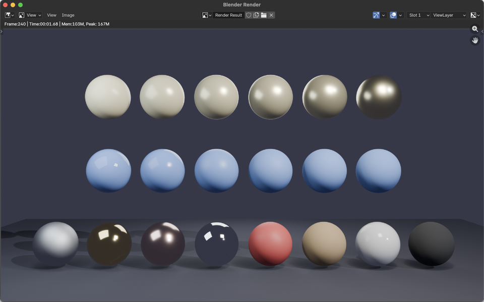

# Actividad S4_1 - Fundamentos Físicos del Rendering

## Nombre de los estudiantes

- Sebastián Andrade Cedano
- Esteban Barrera Sanabria
- Cristian Steven Motta Ojeda
- Juan Esteban Santacruz Corredor

## Fecha de entrega

`2026-03-02`

---

## Descripción breve

En esta actividad se trabajó el tema de **Estandarización Industrial del PBR (Physically Based Rendering)**, explorando cómo los modelos físicos de interacción luz-materia se traducen en flujos de trabajo utilizables dentro de motores gráficos reales.

El objetivo principal fue comprender los parámetros fundamentales del flujo **Metalness** — **Albedo**, **Metallic** y **Roughness** — así como la distinción física entre materiales **dieléctricos** (no metálicos) y **conductores** (metálicos), y cómo estos conceptos se implementan de forma estandarizada en motores como Blender mediante el shader **Principled BSDF**.

Se construyó un script de Python para Blender que genera una escena con tres filas de esferas que demuestran visualmente el efecto de variar los parámetros PBR: un gradiente de metalicidad, un gradiente de rugosidad y una fila de materiales canónicos del mundo real (hierro, oro, cobre, aluminio, plástico, madera, mármol y caucho).

---

## Temas abordados

**Tema 9: Estandarización Industrial del PBR**

- **Albedo (Base Color):** color base de la superficie que representa la fracción de luz reflejada de forma difusa (dieléctricos) o el color de la reflexión especular (metales). Se expresa como un valor RGB en rango lineal, típicamente con valores entre 0.04 y 0.8 para dieléctricos.
- **Metallic:** parámetro binario (0 o 1 en la práctica, interpolable para transiciones) que indica si la superficie se comporta como un conductor o un dieléctrico. Los metales reflejan la luz de forma especular con el color del albedo; los dieléctricos tienen reflexión especular acromática.
- **Roughness:** controla la dispersión de las microfacetas de la superficie. Un valor de 0 produce reflexiones perfectamente especulares (espejo), mientras que un valor de 1 genera reflexiones completamente difusas. Se relaciona con la distribución de normales de microfacetas (NDF).
- **Dieléctricos vs. conductores:** los dieléctricos (plástico, madera, cerámica) tienen baja reflectancia especular (~4% a incidencia normal, según Fresnel) y exhiben difusión subsuperficial. Los conductores (metales) absorben toda la luz refractada y su reflectancia especular es alta y cromática.
- **Flujo Metalness:** estándar industrial adoptado por Disney, Unreal Engine, Unity y Blender que simplifica la parametrización de materiales a tres mapas principales: Base Color, Metallic y Roughness, en contraste con el flujo Specular/Glossiness más antiguo.
- **Principled BSDF:** shader unificado de Blender basado en el modelo de Disney que combina múltiples capas (difusa, especular, subsuperficial, clearcoat, sheen) en un solo nodo parametrizable, cumpliendo conservación de energía y reciprocidad de Helmholtz.

---

## Explicación matemática resumida

El flujo PBR Metalness se fundamenta en el modelo de microfacetas Cook-Torrance. La BRDF especular se expresa como:

$$f_r(\omega_i, \omega_o) = \frac{D(h) \cdot F(\omega_i, h) \cdot G(\omega_i, \omega_o)}{4 \cdot (\omega_o \cdot n) \cdot (\omega_i \cdot n)}$$

Donde:
- $D(h)$ es la **distribución de normales de microfacetas** (NDF), controlada por el parámetro Roughness ($\alpha$). Para GGX: $D(h) = \frac{\alpha^2}{\pi \left((\mathbf{n} \cdot \mathbf{h})^2 (\alpha^2 - 1) + 1\right)^2}$
- $F(\omega_i, h)$ es el **término de Fresnel**, que determina la reflectancia según el ángulo de incidencia. La aproximación de Schlick: $F(\theta) = F_0 + (1 - F_0)(1 - \cos\theta)^5$
- $G(\omega_i, \omega_o)$ es el **término geométrico** que modela el auto-sombreado entre microfacetas.

El parámetro **Metallic** interpola entre:
- $F_0 = 0.04$ (dieléctrico típico) cuando Metallic = 0
- $F_0 = \text{Base Color}$ (color del metal) cuando Metallic = 1

---

## Implementación

### Blender (Python Script)

Se desarrolló un script de Python (`blender/script.py`) que genera automáticamente una escena completa en Blender con **20 esferas** organizadas en tres filas para demostrar el efecto de los parámetros PBR:

| Fila | Concepto | Parámetro variable | Parámetro fijo |
|------|----------|---------------------|----------------|
| Superior | Gradiente de metalicidad | Metallic: 0.0 → 1.0 (6 pasos) | Roughness: 0.3 |
| Media | Gradiente de rugosidad | Roughness: 0.0 → 1.0 (6 pasos) | Metallic: 0.0 |
| Inferior | Materiales del mundo real | Valores calibrados por material | Valores calibrados por material |

**Materiales canónicos implementados:**

| Material | Base Color | Metallic | Roughness | Tipo |
|----------|-----------|----------|-----------|------|
| Iron | (0.77, 0.78, 0.78) | 1.0 | 0.60 | Conductor |
| Gold | (1.00, 0.77, 0.33) | 1.0 | 0.10 | Conductor |
| Copper | (0.95, 0.64, 0.54) | 1.0 | 0.20 | Conductor |
| Aluminum | (0.91, 0.92, 0.92) | 1.0 | 0.05 | Conductor |
| Plastic | (0.90, 0.10, 0.10) | 0.0 | 0.50 | Dieléctrico |
| Wood | (0.60, 0.40, 0.20) | 0.0 | 0.85 | Dieléctrico |
| Marble | (0.90, 0.90, 0.88) | 0.0 | 0.15 | Dieléctrico |
| Rubber | (0.05, 0.05, 0.05) | 0.0 | 0.95 | Dieléctrico |

**Características implementadas:**

- **Shader Principled BSDF:** cada material se construye programáticamente asignando Base Color, Metallic y Roughness al nodo `ShaderNodeBsdfPrincipled` de Blender.
- **Iluminación de tres puntos:** key light cálida (2000 W), fill light fría (600 W) y rim light (800 W) para separación de bordes, complementadas con un sun light ambiental.
- **Animación turntable:** rotación de 360° de la escena completa en 240 frames (10 segundos a 24 fps) para apreciar las reflexiones desde múltiples ángulos.
- **Plano de piso:** superficie oscura con alta rugosidad para dar contexto espacial a las esferas.
- **Esferas de alta resolución:** 64 segmentos × 32 anillos con smooth shading para minimizar artefactos de facetado.

---

## Código relevante

Función de creación de materiales PBR con el Principled BSDF:

```python
def create_material(name, color, metallic, roughness):
    """Create a Principled BSDF material with the given PBR parameters."""
    mat = bpy.data.materials.new(name=name)
    mat.use_nodes = True
    nodes = mat.node_tree.nodes
    links = mat.node_tree.links
    nodes.clear()
    bsdf = nodes.new("ShaderNodeBsdfPrincipled")
    bsdf.inputs["Base Color"].default_value = color
    bsdf.inputs["Metallic"].default_value = metallic
    bsdf.inputs["Roughness"].default_value = roughness
    out = nodes.new("ShaderNodeOutputMaterial")
    links.new(bsdf.outputs["BSDF"], out.inputs["Surface"])
    return mat
```

Definición de materiales canónicos con parámetros PBR calibrados:

```python
materials = [
    ("Iron",     (0.77, 0.78, 0.78, 1.0), 1.0, 0.60),
    ("Gold",     (1.00, 0.77, 0.33, 1.0), 1.0, 0.10),
    ("Copper",   (0.95, 0.64, 0.54, 1.0), 1.0, 0.20),
    ("Aluminum", (0.91, 0.92, 0.92, 1.0), 1.0, 0.05),
    ("Plastic",  (0.90, 0.10, 0.10, 1.0), 0.0, 0.50),
    ("Wood",     (0.60, 0.40, 0.20, 1.0), 0.0, 0.85),
    ("Marble",   (0.90, 0.90, 0.88, 1.0), 0.0, 0.15),
    ("Rubber",   (0.05, 0.05, 0.05, 1.0), 0.0, 0.95),
]
```

---

## Resultados visuales

### Captura 1 - Render de esferas PBR



Render final en Blender EEVEE mostrando las tres filas de esferas: fila superior con gradiente de metalicidad (de dieléctrico a metálico), fila media con gradiente de rugosidad (de especular a difuso) y fila inferior con materiales canónicos del mundo real (hierro, oro, cobre, aluminio, plástico, madera, mármol y caucho).

### GIF 1 - Vista de la escena en Blender


Vista del viewport de Blender mostrando la disposición de la escena generada por el script: las 20 esferas organizadas en tres filas, el plano de piso, la iluminación de tres puntos y la cámara principal.

---

## Prompts utilizados

- "Genera un script de Python para Blender que cree una escena con esferas que demuestren los parámetros PBR (Albedo, Metallic, Roughness) usando el Principled BSDF. Incluye una fila con gradiente de metalicidad, otra con gradiente de rugosidad y otra con materiales del mundo real (metales y dieléctricos)."
- "Agrega iluminación de tres puntos (key, fill, rim) más un sun ambiental para que las reflexiones especulares y difusas se aprecien correctamente en cada esfera."
- "Implementa una animación turntable que rote toda la escena 360° para poder apreciar las reflexiones desde distintos ángulos."

---

## Aprendizajes y dificultades

### Aprendizajes

Se comprendió de forma práctica la diferencia fundamental entre materiales dieléctricos y conductores: al variar el parámetro Metallic de 0 a 1 se observa claramente cómo la reflexión especular pasa de ser acromática (blanca) a tomar el color del albedo, y cómo desaparece la componente difusa. Igualmente, el gradiente de Roughness permite visualizar cómo la distribución de microfacetas afecta la nitidez de las reflexiones, desde un espejo perfecto hasta una superficie completamente mate.

### Dificultades

La calibración de los valores de Base Color para los metales fue desafiante, ya que los valores de reflectancia medidos (como los de la base de datos de Filament de Google) están en espacio lineal y difieren significativamente de lo que se percibe visualmente en sRGB. También fue necesario ajustar la intensidad y posición de las luces para que tanto los materiales muy rugosos (que necesitan más luz para ser visibles) como los muy especulares (que generan highlights intensos) se apreciaran correctamente en el mismo encuadre.

### Mejoras futuras

Como mejora, se podría agregar etiquetas flotantes sobre cada esfera indicando los valores de Metallic y Roughness, implementar una versión interactiva en Three.js con sliders para modificar los parámetros en tiempo real, e incluir materiales con texturas (normal maps, roughness maps) para demostrar el flujo PBR completo con mapas de textura.

---

## Participación por integrante

- **Sebastián Andrade Cedano:** se encargó de la investigación teórica sobre el flujo Metalness, recopilando las especificaciones del modelo de Disney y las diferencias entre dieléctricos y conductores para estructurar la presentación.
- **Esteban Barrera Sanabria:** diseñó y construyó las diapositivas de la exposición, organizando la progresión desde los fundamentos físicos de la BRDF hasta la estandarización industrial en motores, incluyendo diagramas comparativos.
- **Cristian Steven Motta Ojeda:** desarrolló el script de Python para Blender, implementando la generación procedural de materiales PBR, la iluminación de tres puntos y la animación turntable.
- **Juan Esteban Santacruz Corredor:** realizó los renders y capturas de la escena, documentó los resultados visuales y apoyó en la redacción del informe final.

---

## Estructura del proyecto

```
semana_04_1_fundamentos_fisicos_rendering/
├── media/                              # Capturas, GIFs y recursos visuales
│   ├── blender_1.png                   # Render de esferas PBR
│   └── blender_2.gif                   # Vista de la escena en el viewport de Blender
├── presentacion/                       # Diapositivas de la exposición
│   └── estandarizacion_industrial_del_pbr.pdf
├── blender/                            # Script de Python para Blender
│   └── script.py                       # Script que genera la escena PBR completa
├── actividad.md                        # Descripción de la actividad
└── README.md                           # Documentación de la actividad
```

---

## Referencias

- Documentación de Blender — Principled BSDF: https://docs.blender.org/manual/en/latest/render/shader_nodes/shader/principled.html
- Burley, B. — *Physically Based Shading at Disney* (SIGGRAPH 2012)
- Karis, B. — *Real Shading in Unreal Engine 4* (SIGGRAPH 2013)
- Google Filament — Material Properties: https://google.github.io/filament/Material%20Properties.pdf
- Akenine-Möller, T., Haines, E. & Hoffman, N. — *Real-Time Rendering* (Cap. 9: Physically Based Shading)
- Pharr, M., Jakob, W. & Humphreys, G. — *Physically Based Rendering: From Theory to Implementation*
